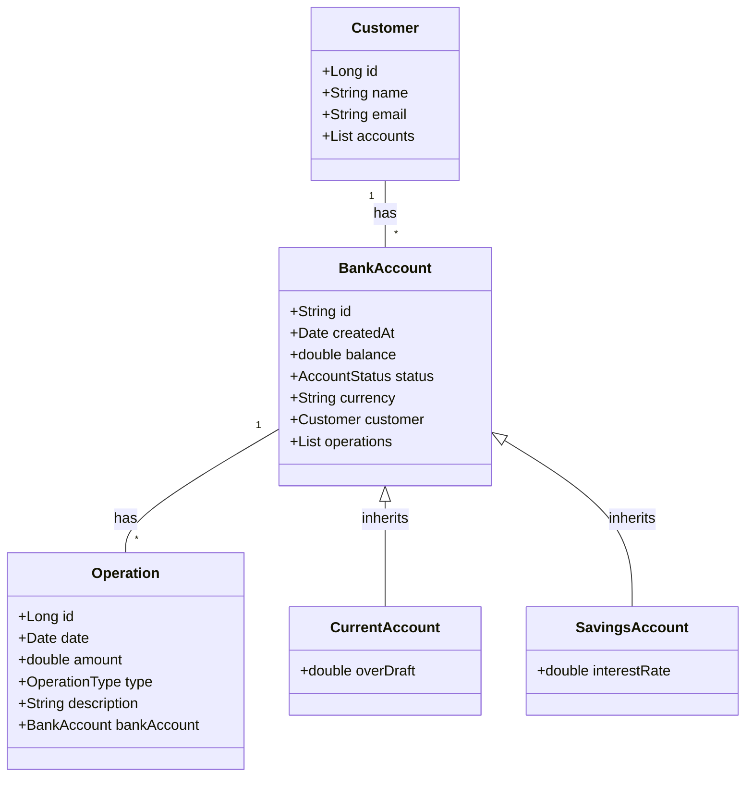

# Chapter 1: Entities (Data Models)

Welcome to the first chapter of our journey through the `Digital-Banking` project! In this chapter, we'll start with the absolute basics: how we represent the core information in our banking system.

Imagine our banking application needs to keep track of customers, their bank accounts, and all the transactions (like deposits and withdrawals) that happen. How do we store all this information in an organized way so our application can use it?

This is where **Entities**, also known as **Data Models**, come in.

## What are Entities (Data Models)?

Think of entities as **blueprints** or **templates** for the data we want to store. They define the structure of the fundamental "things" in our application.

For our banking project, the main "things" are:

*   **Customers:** People who use the bank.
*   **Bank Accounts:** The accounts where money is held.
*   **Operations:** The transactions (like deposits, withdrawals, transfers).

An entity blueprint tells us:

1.  What pieces of information does this "thing" have? (e.g., a Customer has a name, an email).
2.  How do these different "things" relate to each other? (e.g., a Customer can have multiple Bank Accounts).

These entities are crucial because they form the foundation of our database structure. When we define an entity in our code, we are essentially telling our application (and the tools it uses) how to create the necessary tables in our database to store this data.

## Our Core Entities

Let's look at the main entities we'll be using in the `Digital-Banking` project.

### 1. The Customer Entity

The `Customer` entity represents a person who uses the bank. What information do we need to store about a customer? Their name, email, and a unique way to identify them.

Here's a simplified look at its blueprint:

```java
package com.example.backend.entities;

import jakarta.persistence.*; // Tools to work with databases
import lombok.Data; // Helper to automatically add common methods like getters/setters

import java.util.List; // To hold a list of accounts

@Entity // <-- This tells the system this is a data blueprint
@Data // <-- Lombok adds getters, setters, etc.
@NoArgsConstructor @AllArgsConstructor // <-- Lombok adds constructors
public class Customer {
    @Id // <-- This field is the unique identifier (like a primary key)
    @GeneratedValue(strategy = GenerationType.IDENTITY) // <-- How the ID is generated (auto-increment)
    private Long id;
    private String name;
    private String email;

    // How Customer relates to BankAccount:
    @OneToMany(mappedBy = "customer", fetch = FetchType.LAZY) // <-- One customer can have Many BankAccounts
    private List<BankAccount> accounts; // <-- A list to hold the customer's accounts
}
```

*   `@Entity`: This is the most important part. It tells the Java Persistence API (JPA), a tool we use to interact with databases, that this `Customer` class is an entity and should be mapped to a table in our database.
*   `@Id`: Marks the `id` field as the primary key, the unique identifier for each customer record.
*   `@GeneratedValue`: Specifies how the `id` is automatically generated (in this case, the database handles it by incrementing the number for each new customer).
*   `@Data`, `@NoArgsConstructor`, `@AllArgsConstructor`: These are from the Lombok library and help reduce boilerplate code. They automatically create methods like `getId()`, `setName()`, constructors, etc., so we don't have to write them manually.
*   `@OneToMany(mappedBy = "customer", ...)`: This defines a relationship. It says **One** `Customer` can be linked to **Many** `BankAccount` entities. The `mappedBy = "customer"` part indicates that the `BankAccount` entity is responsible for managing this relationship using its `customer` field.

### 2. The Bank Account Entity and its Types

A `BankAccount` represents an account holding money. There are different *types* of bank accounts, like Current Accounts and Savings Accounts. They share common information (like balance, creation date) but also have some unique details.

We model this using **inheritance**. A `CurrentAccount` *is a* `BankAccount`, and a `SavingsAccount` *is a* `BankAccount`.

Here's the base `BankAccount` blueprint:

```java
package com.example.backend.entities;

import com.example.backend.enums.AccountStatus; // An 'enum' for account status (CREATED, ACTIVATED, etc.)
import jakarta.persistence.*;
import lombok.AllArgsConstructor;
import lombok.Data;
import lombok.NoArgsConstructor;

import java.util.Date;
import java.util.List;

@Entity // <-- Blueprint for database
@Inheritance(strategy = InheritanceType.SINGLE_TABLE) // <-- How inheritance is handled in the database
@DiscriminatorColumn(name = "TYPE", length = 4) // <-- A column to store the type (CA or SA)
@Data @NoArgsConstructor @AllArgsConstructor
public class BankAccount {
    @Id // <-- Unique ID for the account
    private String id; // Using a String for account ID
    private Date createdAt;
    private double balance;
    private AccountStatus status;
    private String currency;

    // How BankAccount relates to Customer:
    @ManyToOne // <-- Many BankAccounts belong to One Customer
    private Customer customer; // <-- The customer this account belongs to

    // How BankAccount relates to Operation:
    @OneToMany(mappedBy = "bankAccount", fetch = FetchType.LAZY) // <-- One BankAccount can have Many Operations
    private List<Operation> operations; // <-- A list of operations on this account
}
```

*   `@Inheritance(strategy = InheritanceType.SINGLE_TABLE)`: This annotation tells JPA to store all types of bank accounts (`BankAccount`, `CurrentAccount`, `SavingsAccount`) in a *single database table*.
*   `@DiscriminatorColumn(name = "TYPE", ...)`: In that single table, a special column named `TYPE` will be added to indicate whether a row represents a `CurrentAccount` (`CA`) or a `SavingsAccount` (`SA`).
*   `@ManyToOne`: This defines a relationship from `BankAccount` back to `Customer`. It says **Many** `BankAccount` entities are linked to **One** `Customer` entity.
*   `@OneToMany`: Defines the relationship with `Operation`. **One** `BankAccount` can have **Many** `Operation` entities.

Now, let's look at the specific types:

**Current Account (`CurrentAccount`):**

```java
package com.example.backend.entities;

import jakarta.persistence.DiscriminatorValue; // To set the value for the TYPE column
import jakarta.persistence.Entity;
import lombok.AllArgsConstructor;
import lombok.Data;
import lombok.NoArgsConstructor;

@Entity
@DiscriminatorValue("CA") // <-- Sets the TYPE column value to "CA" for this entity
@Data @NoArgsConstructor @AllArgsConstructor
public class CurrentAccount extends BankAccount{ // <-- Inherits from BankAccount
    private double overDraft; // <-- Specific field for Current Account
}
```

*   `extends BankAccount`: This shows it inherits all the fields and relationships from `BankAccount`.
*   `@DiscriminatorValue("CA")`: When a `CurrentAccount` is saved, the `TYPE` column in the `BankAccount` table will be set to `"CA"`.
*   `overDraft`: This is a field unique to current accounts.

**Savings Account (`SavingsAccount`):**

```java
package com.example.backend.entities;

import jakarta.persistence.DiscriminatorValue; // To set the value for the TYPE column
import jakarta.persistence.Entity;
import lombok.AllArgsConstructor;
import lombok.Data;
import lombok.NoArgsConstructor;

@Entity
@DiscriminatorValue("SA") // <-- Sets the TYPE column value to "SA" for this entity
@Data @NoArgsConstructor @AllArgsConstructor
public class SavingsAccount extends BankAccount{ // <-- Inherits from BankAccount
    private double interestRate; // <-- Specific field for Savings Account
}
```

*   `extends BankAccount`: Inherits from `BankAccount`.
*   `@DiscriminatorValue("SA")`: When a `SavingsAccount` is saved, the `TYPE` column will be set to `"SA"`.
*   `interestRate`: A field unique to savings accounts.

### 3. The Operation Entity

The `Operation` entity represents a transaction (like a deposit or withdrawal) on a bank account.

```java
package com.example.backend.entities;

import com.example.backend.enums.OperationType; // An 'enum' for operation type (CREDIT, DEBIT)
import jakarta.persistence.*;
import lombok.AllArgsConstructor;
import lombok.Data;
import lombok.NoArgsConstructor;

import java.util.Date;

@Entity // <-- Blueprint for database
@Data @AllArgsConstructor @NoArgsConstructor
public class Operation {
    @Id
    @GeneratedValue(strategy = GenerationType.IDENTITY)
    private Long id;
    private Date date;
    private double amount;
    private OperationType type; // CREDIT or DEBIT
    private String description;

    // How Operation relates to BankAccount:
    @ManyToOne // <-- Many Operations happen on One BankAccount
    private BankAccount bankAccount; // <-- The account this operation happened on
}
```

*   `@Entity`, `@Id`, `@GeneratedValue`, `@Data`, etc. are similar to the other entities.
*   `@ManyToOne`: Defines the relationship to `BankAccount`. **Many** `Operation` entities are linked to **One** `BankAccount` entity.

## How Entities Define Relationships

The `@OneToMany` and `@ManyToOne` annotations are how we tell our application (and database) how our entities are connected.

*   **One-to-Many:** A `Customer` can have `Many` `BankAccount`s. A `BankAccount` can have `Many` `Operation`s.
*   **Many-to-One:** `Many` `BankAccount`s belong to `One` `Customer`. `Many` `Operation`s happen on `One` `BankAccount`.

These relationships are stored in the database using foreign keys, which are like pointers linking rows in one table to rows in another table.

Here's a simple diagram showing how these entities relate:



This diagram visually represents the blueprints and their connections. A `Customer` is linked to `BankAccount`, `BankAccount` is linked to `Operation`, and `CurrentAccount` and `SavingsAccount` are specific types of `BankAccount`.

## The Role of Enums

You might have noticed `AccountStatus` and `OperationType` in the entity definitions. These are **enums** (enumerations).

*   An `enum` is a special type that allows a variable to be a set of predefined constants.
*   `AccountStatus` can *only* be `CREATED`, `ACTIVATED`, or `SUSPENDED`.
*   `OperationType` can *only* be `CREDIT` or `DEBIT`.

This is useful for ensuring that the data stored for status and type is always valid and comes from a known list of options.

Here's what the enums look like (very simple):

```java
// AccountStatus.java
package com.example.backend.enums;

public enum AccountStatus {
    CREATED, ACTIVATED, SUSPENDED
}
```

```java
// OperationType.java
package com.example.backend.enums;

public enum OperationType {
    CREDIT, DEBIT
}
```

They just list the possible values.

## What Happens Under the Hood?

When you run the application with these entity definitions and a configured database, tools like JPA will automatically:

1.  Look at each class marked with `@Entity`.
2.  Create corresponding tables in your database (e.g., a `customer` table, a `bank_account` table, an `operation` table).
3.  Define columns in those tables based on the fields in your entity classes (e.g., the `customer` table will have `id`, `name`, `email` columns).
4.  Handle the relationships. For example, the `bank_account` table will get a foreign key column (`customer_id`) linking it to the `customer` table, and the `operation` table will get a foreign key column (`bank_account_id`) linking it to the `bank_account` table.
5.  For the inherited `BankAccount`, `CurrentAccount`, `SavingsAccount`, it creates *one* `bank_account` table with an extra `TYPE` column and columns for all fields (`id`, `createdAt`, `balance`, `status`, `currency`, `customer_id`, `over_draft`, `interest_rate`). Rows representing Current Accounts will have `TYPE='CA'` and a value in `over_draft`. Rows for Savings Accounts will have `TYPE='SA'` and a value in `interest_rate`.

So, by simply defining these Java classes with annotations, we've designed the fundamental structure of our database!

## Conclusion

In this chapter, we learned about **Entities (Data Models)**, which are the blueprints for the core data in our banking application. We explored the main entities: `Customer`, `BankAccount` (and its types `CurrentAccount`, `SavingsAccount`), and `Operation`. We saw how annotations like `@Entity`, `@Id`, `@OneToMany`, and `@ManyToOne` define the structure of the data and the relationships between different pieces of data. These entities form the basis for how our application interacts with the database.

Understanding these data models is the first step. However, when we exchange data, especially with the outside world (like a web browser), we often use a slightly different representation. In the next chapter, we'll learn about **Data Transfer Objects (DTOs)** and why they are useful.

[Next Chapter: Data Transfer Objects (DTOs)](02_data_transfer_objects__dtos__.md)

---
