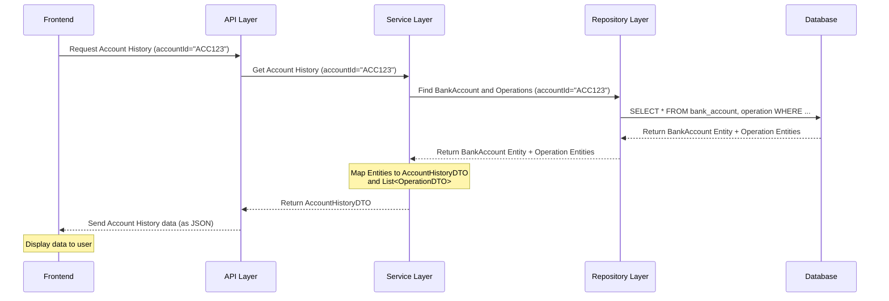

# Chapter 2: Data Transfer Objects (DTOs)

Welcome back to our `Digital-Banking` tutorial! In the [previous chapter](01_entities__data_models__.md), we learned about **Entities**, which are the blueprints for how we store our core banking data like Customers and Bank Accounts in the database. Entities are powerful for defining our data structure and relationships for persistence.

However, when different parts of our application need to *talk* to each other, especially when sending data over a network (like to a web browser), using the raw Entity objects directly isn't always the best approach. Why?

Imagine our `Customer` entity from the last chapter. It has a field `accounts` which holds a `List<BankAccount>`. Each `BankAccount` has a `List<Operation>`, and so on. If we tried to send a `Customer` entity directly to the frontend, we might accidentally send a huge, complex object containing *all* of their accounts and *all* transactions, which is often way more data than needed for a simple task like displaying the customer's name and email. Also, entities often have database-specific annotations (`@Entity`, `@Table`, etc.) that are irrelevant and potentially confusing outside the data layer.

This is where **Data Transfer Objects (DTOs)** come into play.

## What are Data Transfer Objects (DTOs)?

Think of DTOs as **simple packages of data designed specifically for transferring information** between different layers or parts of your application. They are like structured messages.

They are called "Data Transfer Objects" because their main job is to *transfer data*.

Key characteristics of DTOs:

*   **Simple Data Structures:** They are usually just plain classes with fields, getters, and setters. They typically don't contain complex business logic.
*   **Subset of Entity Data:** Often, a DTO contains only *some* of the fields from an Entity, tailored for a specific purpose (e.g., just name and email for a customer list).
*   **Can Combine Data:** A DTO might combine data from *multiple* Entities or include calculated values that don't exist directly in any single Entity.
*   **Decoupling:** They help separate concerns. The frontend doesn't need to know anything about how data is stored in the database (the Entities). It only needs to know the structure of the DTO it receives.

## The Problem DTOs Solve: Sending Data Cleanly

Let's use our banking example. Suppose the frontend wants to display a list of customers, showing only their ID, name, and email.

If we returned the `Customer` Entity directly:

```java
// Imagine this is the data from the backend
// This includes potentially sensitive info or large related data lists
Customer customer = new Customer();
customer.setId(1L);
customer.setName("Alice Smith");
customer.setEmail("alice.smith@example.com");
// ... and a list of ALL her accounts and ALL operations
// customer.setAccounts([...]); // This list could be huge!
```

Sending this entire structure is inefficient and exposes internal details.

Instead, we create a `CustomerDTO` that contains *only* the data the frontend needs for this specific view:

```java
// This is the data we'll actually send
CustomerDTO customerDTO = new CustomerDTO();
customerDTO.setId(1L);
customerDTO.setName("Alice Smith");
customerDTO.setEmail("alice.smith@example.com");
// That's it! No accounts list attached here.
```

This `CustomerDTO` is much lighter and contains exactly what's required.

## Our Core DTOs

Looking at the DTO files provided, we can see several DTOs corresponding to our Entities and specific operations:

### 1. `CustomerDTO`

This mirrors the `Customer` entity but is simplified for data transfer.

```java
package com.example.backend.dtos;

import lombok.AllArgsConstructor;
import lombok.Data;
import lombok.NoArgsConstructor;

@Data
@AllArgsConstructor
@NoArgsConstructor
public class CustomerDTO {
    private Long id;
    private String name;
    private String email;
    // Notice: No List<BankAccount> here, unlike the Customer Entity!
}
```

This DTO is perfect for operations that just need basic customer information, like listing customers or showing customer details without showing their full account history immediately.

### 2. `BankAccountDTO` and Specific Types

Similar to how our Entities used inheritance, our DTOs for bank accounts also follow a pattern:

*   `BankAccountDTO`: A base class just indicating the account type.
*   `CurrentBankAccountDTO`: Extends `BankAccountDTO` and includes fields for Current Accounts.
*   `SavingsBankAccountDTO`: Extends `BankAccountDTO` and includes fields for Savings Accounts.

```java
// BankAccountDTO.java
package com.example.backend.dtos;
import lombok.Data;
// No specific fields here, just a base for type
@Data
public class BankAccountDTO {
    private String type; // To indicate "CA" or "SA"
}
```

```java
// CurrentBankAccountDTO.java
package com.example.backend.dtos;
import com.example.backend.enums.AccountStatus; // Using the same enum
import lombok.Data;
import java.util.Date;

@Data
public class CurrentBankAccountDTO extends BankAccountDTO{
    private String id;
    private Date createdAt;
    private double balance;
    private AccountStatus status;
    private String currency;
    private double overDrat;
    private CustomerDTO customerDTO; // Includes related customer info via DTO

}
```

```java
// SavingsBankAccountDTO.java
package com.example.backend.dtos;
import com.example.backend.enums.AccountStatus; // Using the same enum
import lombok.Data;
import java.util.Date;

@Data
public class SavingsBankAccountDTO extends BankAccountDTO{
    private String id;
    private Date createdAt;
    private double balance;
    private AccountStatus status;
    private String currency;
    private double interestRate;
    private CustomerDTO customerDTO; // Includes related customer info via DTO

}
```

These DTOs contain the relevant fields from the `BankAccount`, `CurrentAccount`, and `SavingsAccount` Entities, plus a `CustomerDTO` to provide the customer's basic info without pulling in *their* list of accounts. They represent the account data in a format suitable for sending to the frontend for display or processing.

### 3. `OperationDTO`

This mirrors the `Operation` entity.

```java
// OperationDTO.java
package com.example.backend.dtos;
import com.example.backend.enums.OperationType; // Using the same enum
import lombok.Data;
import java.util.Date;

@Data
public class OperationDTO {
    private Long id;
    private Date date;
    private double amount;
    private OperationType type; // CREDIT or DEBIT
    private String description;
    // Notice: No BankAccount Entity here! We don't need the full account object
    // for each operation when viewing a list of operations.
}
```

This is used when we need to show details of transactions without needing the full `BankAccount` object attached to each one.

### 4. `AccountHistoryDTO`: Combining Data

This is a great example of a DTO that doesn't directly map to a single Entity but combines information from several to provide a specific view:

```java
// AccountHistoryDTO.java
package com.example.backend.dtos;
import lombok.Data;
import java.util.List;

@Data
public class AccountHistoryDTO {
    private String accountId;
    private double balance; // Current balance of the account
    private int currentPage; // Info for pagination
    private int totalPages; // Info for pagination
    private int pageSize;   // Info for pagination
    private List<OperationDTO> accountOperationDTOS; // A list of operations (as DTOs)

}
```

When the frontend wants to see the history for a specific account, the backend will fetch the `BankAccount` entity and its related `Operation` entities. It then packages this data into an `AccountHistoryDTO`, which includes the account's ID and current balance, plus a list of `OperationDTO`s (not `Operation` entities!), and also adds pagination information (`currentPage`, `totalPages`). This DTO is specifically designed for displaying an account's history on the UI.

### 5. DTOs for Input Data

DTOs aren't just for sending data *out*. They are also used for receiving data *in* from the frontend. When you make a request that sends data to the backend (like making a deposit or transfer), you send a DTO.

*   `CreditDTO`: Used when depositing money.
*   `DebitDTO`: Used when withdrawing money.
*   `TransferRequestDTO`: Used when transferring money between accounts.

```java
// CreditDTO.java
package com.example.backend.dtos;
import lombok.Data;

@Data
public class CreditDTO {
    private String accountId; // Which account to credit
    private double amount;   // How much
    private String description; // Why
}
```

```java
// TransferRequestDTO.java
package com.example.backend.dtos;
import lombok.Data;

@Data
public class TransferRequestDTO {
    private String accountSource;      // Account to debit
    private String accountDestination; // Account to credit
    private double amount;             // How much
    private String description;        // Why
}
```

When the backend receives a `TransferRequestDTO`, it uses the data within it to find the relevant `BankAccount` Entities using their IDs, perform the transfer logic, create new `Operation` Entities, and save the changes.

## How DTOs are Used in Practice (The Workflow)

Let's trace the flow for getting account history, using our new `AccountHistoryDTO`.

1.  The frontend (e.g., a web page) needs to display the history for a specific bank account (say, account "ACC123").
2.  The frontend sends a request to the backend, asking for the history of "ACC123".
3.  The backend receives this request in its API Layer (which we'll cover in [Chapter 5: API Layer (REST Controllers)](05_api_layer__rest_controllers__.md)).
4.  The API Layer passes the request (specifically, the account ID "ACC123") to the Business Logic Layer (which we'll cover in [Chapter 4: Business Logic Layer (Services)](04_business_logic_layer__services__.md)).
5.  The Business Logic Layer needs the actual data. It interacts with the [Data Access Layer (Repositories)](03_data_access_layer__repositories__.md) to fetch the `BankAccount` Entity for "ACC123" and its associated `Operation` Entities from the database.
6.  The Business Logic Layer now has the Entity objects. It then **transforms** or **maps** the data from the `BankAccount` Entity and the `Operation` Entities into an `AccountHistoryDTO`. It populates the DTO's fields: setting the `accountId`, `balance`, pagination info, and creating a list of `OperationDTO`s from the `Operation` Entities.
7.  The Business Logic Layer returns this `AccountHistoryDTO` to the API Layer.
8.  The API Layer takes the `AccountHistoryDTO` and sends it back to the frontend, usually formatted as JSON data over the internet.
9.  The frontend receives the JSON data, understands its structure because it matches the `AccountHistoryDTO` blueprint it expects, and uses the data to display the account ID, balance, and list of operations to the user.

Here's a simplified sequence:



This diagram shows how the data flows and changes form. Entities are used within the backend layers that interact with the database ([Data Access Layer (Repositories)](03_data_access_layer__repositories__.md) and [Business Logic Layer (Services)](04_business_logic_layer__services__.md)). DTOs are used at the boundaries, like when the [API Layer (REST Controllers)](05_api_layer__rest_controllers__.md) communicates with the frontend, or when the [Business Logic Layer (Services)](04_business_logic_layer__services__.md) receives input from the API.

## Why Use DTOs? A Quick Summary Table

| Feature           | Entities (Chapter 1)                       | DTOs                                          |
| :---------------- | :----------------------------------------- | :-------------------------------------------- |
| **Purpose**       | Define database structure & relationships | Transfer data between layers/applications     |
| **Content**       | Often full data + relationships           | Subset of data, specific to use case, simple  |
| **Complexity**    | Can be complex due to relationships       | Usually simple data fields                    |
| **Database Info** | Contains database annotations (`@Entity`) | No database annotations                       |
| **Use Case**      | Storing and retrieving data from DB       | Sending/receiving data over network, APIs     |
| **Location**      | Primarily in data/persistence layer       | At application boundaries (API <-> Frontend)  |

Using DTOs is a standard practice in application development because it improves clarity, security (by not exposing unnecessary data), and maintainability by decoupling layers.

## Conclusion

In this chapter, we introduced **Data Transfer Objects (DTOs)**. We learned that while Entities are crucial for defining our database structure, DTOs are lightweight data containers used for sending information between different parts of our application, particularly between the backend and the frontend. We saw how they simplify data structures, provide tailored views of data, and are used for both sending data out and receiving data in.

Understanding the distinction between Entities and DTOs is key to building clean, maintainable applications. DTOs act as the structured messages exchanged between components.

Now that we know how to represent our data for storage (Entities) and how to package it for transfer (DTOs), the next logical step is to understand how our application actually *gets* the data from the database. In the next chapter, we will dive into the **Data Access Layer (Repositories)**.

[Next Chapter: Data Access Layer (Repositories)](03_data_access_layer__repositories__.md)

---
