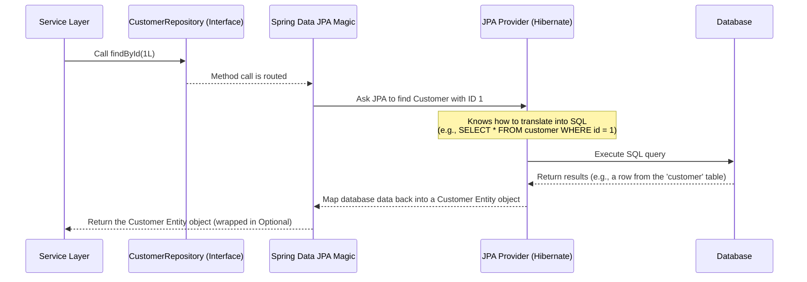

# Chapter 3: Data Access Layer (Repositories)

Welcome back, future digital banker! In the [previous chapter](02_data_transfer_objects__dtos__.md), we discussed **Data Transfer Objects (DTOs)** – the simple messages we use to pass data around our application, especially between the backend and frontend. Before that, in [Chapter 1: Entities (Data Models)](01_entities__data_models__.md), we learned about **Entities**, the blueprints for how we store information like Customers and Bank Accounts in our database.

Now, we know *what* data we want to store (Entities) and *how* we might want to package it for transfer (DTOs). But how do we actually *get* data *from* the database, or *save* new data *into* it? We need a way for our application to communicate directly with the database.

This is the job of the **Data Access Layer**, and in our Spring Boot project, this layer is primarily built using **Repositories**.

## What is the Data Access Layer?

Imagine the database is like a secure vault containing all our banking information. The Data Access Layer is the **authorized entry point** to that vault. It's the part of our application specifically designed to:

*   Send commands to the database (like "get me customer number 123").
*   Receive data back from the database.
*   Translate the application's requests into the language the database understands (SQL, usually).
*   Handle saving, updating, and deleting data.

Without this layer, other parts of our application would have to know complex database details, which is messy and makes our code hard to change (what if we switch databases?).

## What are Repositories?

In Spring Data JPA, the Data Access Layer is beautifully simplified using **Repositories**.

Think of a Repository as a **special interface** that defines a set of operations you can perform on a specific Entity type. It's like a menu of actions for managing your data in the database.

The magical part? With Spring Data JPA, you often don't have to write the code that *implements* these operations. You just define the interface, and Spring Data JPA automatically provides the implementation for common tasks!

It's like ordering food at a restaurant: you tell the waiter ("the interface") what you want (e.g., "one findAll for Customers"), and the kitchen staff ("Spring Data JPA") knows exactly how to prepare it (write the SQL, execute it, get the results, and give you back the `List<Customer>`). You don't need to know *how* they cooked it, just *that* you can order it.

For each major Entity (like `Customer`, `BankAccount`, `Operation`), we'll typically have a corresponding Repository interface.

## Our Core Repositories

In our `Digital-Banking` project, we have three main Repository interfaces, one for each of our core entities:

1.  `CustomerRepository`: For accessing `Customer` data.
2.  `BankAccountRepository`: For accessing `BankAccount` data.
3.  `OperationRepository`: For accessing `Operation` data.

Let's look at them.

### 1. `CustomerRepository`

Here is the basic structure of our `CustomerRepository`:

```java
package com.example.backend.repositories;

import com.example.backend.entities.Customer; // Import the Customer Entity
import org.springframework.data.jpa.repository.JpaRepository; // Import JpaRepository

// Declare the interface and extend JpaRepository
public interface CustomerRepository extends JpaRepository<Customer, Long> {
    // Spring Data JPA will automatically provide methods here!
    // Like: findById(Long id), findAll(), save(Customer entity), delete(Customer entity), etc.

    // We can add custom methods too, like searchCustomer below...
    // But for now, let's focus on the basics from JpaRepository
}
```

*   **`public interface CustomerRepository`**: We define a standard Java interface.
*   **`extends JpaRepository<Customer, Long>`**: This is the key part! We extend `JpaRepository` provided by Spring Data JPA.
    *   `JpaRepository` is a powerful interface that contains definitions for many common database operations (like saving, finding, deleting).
    *   `<Customer, Long>` tells Spring Data JPA two things:
        *   This repository is for the `Customer` **Entity**.
        *   The primary key (ID) type for the `Customer` Entity is `Long` (remember `private Long id;` in our [Chapter 1 Entity](01_entities__data_models__.md)).

**What methods do we get automatically?**

By extending `JpaRepository`, the `CustomerRepository` interface automatically inherits methods like:

*   `Optional<Customer> findById(Long id)`: Find a customer by their ID. Returns an `Optional` because the customer might not exist.
*   `List<Customer> findAll()`: Get a list of *all* customers.
*   `Customer save(Customer entity)`: Save a new customer or update an existing one.
*   `void delete(Customer entity)`: Delete a customer.
*   `long count()`: Get the total number of customers.
*   ... and many more standard operations!

You don't have to write any code for these! Spring Data JPA looks at your interface definition, sees you extended `JpaRepository<Customer, Long>`, and generates the necessary code behind the scenes to connect to the database and perform these actions on the `customer` table.

### How is a Repository Used? (High Level)

Other parts of your application, like the [Business Logic Layer (Services)](04_business_logic_layer__services__.md) (which we'll cover in the next chapter), will use these repositories. They don't interact *directly* with the database or write SQL. They *call methods* on the repository interface.

Imagine code in the Service layer wanting to find a customer:

```java
// Imagine this code is in our Service Layer (explained in Chapter 4)

// First, we need the repository instance. Spring handles this for us
// via a technique called Dependency Injection (don't worry about the details yet)
// @Autowired
// private CustomerRepository customerRepository;

// Now, to find a customer by ID (let's say ID is 1L):
// Optional<Customer> result = customerRepository.findById(1L);

// The 'result' variable now holds the Customer Entity (if found)
// You can check if it's present: if(result.isPresent()) { ... }
// Or get the customer if you are sure it exists: Customer cust = result.get();

// To get ALL customers:
// List<Customer> allCustomers = customerRepository.findAll();

// To save a new customer:
// Customer newCustomer = new Customer();
// newCustomer.setName("Bob");
// newCustomer.setEmail("bob@example.com");
// Customer savedCustomer = customerRepository.save(newCustomer); // 'savedCustomer' will now have the generated ID!
```

This is much cleaner than writing SQL queries directly in our business logic!

### 2. `BankAccountRepository` and `OperationRepository`

The other repositories are similar:

```java
// BankAccountRepository.java
package com.example.backend.repositories;

import com.example.backend.entities.BankAccount; // Import BankAccount Entity
import org.springframework.data.jpa.repository.JpaRepository; // Use JpaRepository

// For BankAccount, the ID type is String
public interface BankAccountRepository extends JpaRepository<BankAccount, String> {
    // Gets automatic methods like findById(String id), findAll(), save(BankAccount entity), etc.
}
```

```java
// OperationRepository.java
package com.example.backend.repositories;

import com.example.backend.entities.Operation; // Import Operation Entity
import org.springframework.data.jpa.repository.JpaRepository; // Use JpaRepository
import org.springframework.data.domain.Page; // For pagination
import org.springframework.data.domain.Pageable; // For pagination

// For Operation, the ID type is Long
public interface OperationRepository extends JpaRepository<Operation, Long> {
    // Gets automatic methods like findById(Long id), findAll(), save(Operation entity), etc.

    // --- Custom Methods ---
    // Spring Data JPA can often generate queries from method names!
    // findByBankAccountId: Finds operations where the 'bankAccount' property has the given ID
    List<Operation> findByBankAccountId(String accountId);

    // findByBankAccountIdOrderByDateDesc: Same as above, but orders by 'date' descending
    // It also accepts a Pageable object to get results page by page
    Page<Operation> findByBankAccountIdOrderByDateDesc(String accountId, Pageable pageable);
}
```

*   `BankAccountRepository` extends `JpaRepository<BankAccount, String>` because `BankAccount` uses a `String` as its ID (`private String id;`).
*   `OperationRepository` extends `JpaRepository<Operation, Long>` because `Operation` uses a `Long` as its ID (`private Long id;`).
*   Notice in `OperationRepository`, we added custom methods: `findByBankAccountId` and `findByBankAccountIdOrderByDateDesc`. Spring Data JPA is smart! For many common query patterns, you just need to follow a naming convention (`findBy` + Entity Property + `And`/`Or`/`OrderBy` + ...), and Spring will automatically figure out the correct database query to execute.

### Adding Custom Queries with `@Query`

Sometimes, the automatic method name generation isn't enough for complex queries. In these cases, you can use the `@Query` annotation to write your own query. This is typically done using **JPQL (Java Persistence Query Language)**, which is similar to SQL but uses the names of your Entities and their fields instead of database table and column names.

Look at the `CustomerRepository` definition from the provided code snippets again:

```java
package com.example.backend.repositories;

import com.example.backend.entities.Customer;
import org.springframework.data.jpa.repository.JpaRepository;
import org.springframework.data.jpa.repository.Query; // Need this for @Query
import org.springframework.data.repository.query.Param; // Need this for @Param

import java.util.List;

public interface CustomerRepository extends JpaRepository<Customer, Long> {
    // This is a custom method using a JPQL query
    @Query("select c from Customer c where c.name like :kw") // The query definition
    List<Customer> searchCustomer(@Param("kw") String keyword); // The method signature
}
```

*   `@Query("select c from Customer c where c.name like :kw")`: This line defines the JPQL query.
    *   `select c from Customer c`: Selects `Customer` entities (aliased as `c`). `Customer` here refers to our Java class, not the database table name.
    *   `where c.name like :kw`: Filters the results where the `name` field of the Customer entity is `LIKE` the value of the parameter `:kw`.
*   `@Param("kw") String keyword`: This annotation binds the `keyword` parameter from the method signature to the `:kw` placeholder in the `@Query` string.

So, when another part of the application calls `customerRepository.searchCustomer("A%")`, Spring Data JPA will execute a database query similar to `SELECT * FROM customer WHERE name LIKE 'A%'` and map the results back into a `List<Customer>` Entities.

## What Happens When a Repository Method is Called? (Under the Hood)

Let's trace what happens when the Service Layer calls something like `customerRepository.findById(1L)`:



1.  The code in the Service Layer calls the `findById` method on the `customerRepository` interface.
2.  Because `customerRepository` is an interface created and managed by Spring Data JPA, Spring intercepts this call.
3.  Spring Data JPA understands the `findById` method (because it comes from `JpaRepository`) and knows it needs to fetch a single entity by its ID.
4.  Spring Data JPA delegates the actual database interaction to a **JPA Provider**, which is usually **Hibernate** in a Spring Boot project.
5.  Hibernate takes the request ("find Customer with ID 1") and generates the appropriate SQL query (`SELECT * FROM customer WHERE id = 1`).
6.  Hibernate executes this SQL query against the configured database.
7.  The database runs the query and returns the raw data (the row from the `customer` table with ID 1).
8.  Hibernate receives the raw data and converts it back into a `Customer` **Entity** object. This process is called **Object-Relational Mapping (ORM)**.
9.  The `Customer` Entity object is returned through Spring Data JPA back to the Service Layer code that made the original call.

The key takeaway is that **you don't write steps 3 through 8!** Spring Data JPA and Hibernate handle all the complexity of database connections, SQL generation, execution, and mapping data back to objects. Your code only needs to define the simple Repository interfaces and call their methods.

## Why is this Approach Good?

*   **Reduces Boilerplate:** You write significantly less code compared to manually writing SQL and JDBC code for every database operation.
*   **Higher Abstraction:** Your application logic works with objects (`Customer` entities) instead of database tables and columns.
*   **Maintainability:** Changes to the database schema or switching databases (less common, but possible) require fewer changes in your application code, as the database-specific logic is hidden within Spring Data JPA and Hibernate.
*   **Readability:** Method names like `findByBankAccountId` are much easier to understand than complex SQL queries scattered throughout your application.

## Conclusion

In this chapter, we explored the **Data Access Layer** and the role of **Repositories** in our `Digital-Banking` project. We learned that Repositories, defined as simple interfaces extending `JpaRepository`, provide a powerful and easy way to interact with our database. Spring Data JPA automatically provides implementations for standard operations, and we can define custom queries either by following method naming conventions or using the `@Query` annotation. This abstraction allows the rest of our application to fetch, save, update, and delete Entities without needing to know the low-level details of database communication.

Now that we have our data models ([Entities](01_entities__data_models__.md)), our data transfer structures ([DTOs](02_data_transfer_objects__dtos__.md)), and the tools to access the database ([Repositories]), we have all the pieces to start building the actual features and logic of our banking application. In the next chapter, we will dive into the **Business Logic Layer (Services)**, where we'll use these repositories to implement operations like creating accounts, making deposits, and listing transactions.

[Next Chapter: Business Logic Layer (Services)](04_business_logic_layer__services__.md)

---
