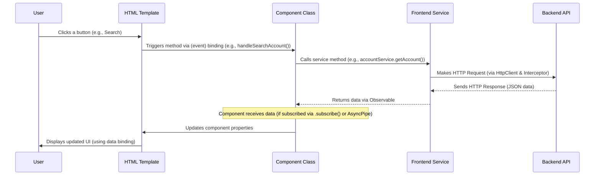

# Chapter 8: Frontend Components

Welcome back to our `Digital-Banking` tutorial! In the [previous chapter](07_frontend_services_.md), we learned about **Frontend Services**, the dedicated classes in our Angular application that handle communication with the backend API, fetching and sending data. We saw how they use `HttpClient` and Observables to manage these asynchronous interactions and how an Interceptor helps with security by adding the JWT automatically.

Now that our frontend knows *how* to get and send data, where does that data actually *go*? How do we display it to the user? How do we allow the user to interact with the application, clicking buttons or filling out forms?

This is the job of **Frontend Components**. They are the visual building blocks of our user interface.

## What are Frontend Components?

Imagine building a house with Lego bricks. Each brick is a component. Some bricks are simple (like a basic wall piece), others are more complex (like a door with a handle). You assemble these bricks to create the whole house.

In our web application, Frontend Components are like those Lego bricks. They are self-contained units that manage a specific **part of the web page**.

For example:

*   A "Customer List" component shows a table of customers.
*   An "Account Details" component displays an account's balance and transaction history.
*   A "Login Form" component handles username and password input.
*   A "Navigation Bar" component provides links to different parts of the application.

Each component combines three key things:

1.  **HTML (Template):** This defines the structure and layout – what the component looks like. It's the visual part.
2.  **TypeScript (Class):** This contains the logic, data (properties), and behavior (methods) for the component. This is where we handle user interactions and talk to our [Frontend Services](07_frontend_services_.md) to get data.
3.  **CSS (Styles):** This determines the appearance – colors, fonts, spacing, etc. (Though in this project, we primarily use Bootstrap CSS classes).

Angular uses the `@Component()` decorator to mark a TypeScript class as a component and link it to its template and styles.

## Key Concepts for Angular Components

Let's look at the structure of a typical component file (`.component.ts`):

```typescript
// A simplified example component structure

import { Component, OnInit } from '@angular/core'; // Need Component decorator, OnInit lifecycle hook
import { SomeService } from '../services/some.service'; // If the component needs a service
import { CommonModule } from '@angular/common'; // Common Angular directives like NgIf, NgFor
// ... other imports for forms, routing, etc.

@Component({ // <-- The decorator that marks this as an Angular component
  selector: 'app-my-component', // <-- How you use this component in other HTML templates (e.g., <app-my-component></app-my-component>)
  standalone: true, // <-- Indicates this is a standalone component (doesn't need an NgModule)
  imports: [ // <-- List of other components/modules/directives/pipes this component uses
    CommonModule, // Includes NgIf, NgFor, etc.
    // Other specific modules like ReactiveFormsModule, RouterLink, AsyncPipe, etc.
  ],
  templateUrl: './my-component.component.html', // <-- Link to the HTML template file
  styleUrl: './my-component.component.css' // <-- Link to the CSS styles file
})
export class MyComponent implements OnInit { // <-- The TypeScript class

  // Properties (data) the component holds
  greeting = 'Hello, World!';
  dataList: any[] = []; // Example: data fetched from a service
  isLoading = false;

  // Dependency Injection: How the component gets services it needs
  constructor(private someService: SomeService) { // <-- Angular injects the SomeService here
    // Constructor is usually for simple initialization, injecting dependencies
  }

  // Lifecycle Hook: Called once after the component is initialized
  ngOnInit(): void {
    // This is a common place to fetch initial data using a service
    // this.fetchData(); // Example call
  }

  // Methods (behavior) for the component
  fetchData(): void {
    this.isLoading = true;
    this.someService.getData().subscribe({ // Call a service method and subscribe to its Observable
      next: (data) => { // When data arrives successfully
        this.dataList = data; // Update component data
        this.isLoading = false;
      },
      error: (error) => { // If an error occurs
        console.error('Error fetching data:', error);
        this.isLoading = false;
        // Handle error display
      }
    });
  }

  // Method to respond to a user click, for example
  handleClick(): void {
    alert(this.greeting);
  }
}
```

*   **`@Component({...})`**: Configures the component.
    *   `selector`: The custom HTML tag you'll use to put this component on a page.
    *   `standalone: true`: (Modern Angular) Makes the component self-contained.
    *   `imports`: Specifies dependencies this component uses (like other components, or Angular features like `NgIf` or `ReactiveFormsModule`).
    *   `templateUrl` / `styleUrl`: Point to the component's visual definition files.
*   **`export class MyComponent implements OnInit`**: The TypeScript class.
    *   **Properties**: Variables that hold the component's data (`greeting`, `dataList`, `isLoading`).
    *   **Constructor**: Used for **Dependency Injection**. Angular looks at the types declared in the constructor (like `private someService: SomeService`) and automatically provides instances of those services when it creates the component.
    *   **`ngOnInit()`**: A **Lifecycle Hook**. Angular calls this method *once* after the component is created and its inputs are set up. It's the standard place to put code that needs to run when the component first appears, like fetching initial data from a service.
    *   **Methods**: Functions that define the component's behavior (e.g., `fetchData`, `handleClick`). These methods are often triggered by user interactions in the template.

The Component's HTML template (`.component.html`) uses Angular's template syntax to:

*   **Display data:** Using `{{ propertyName }}` (interpolation).
*   **Handle events:** Using `(event)="method()"` (event binding), like `(click)="handleClick()"` on a button.
*   **Control the DOM:** Using built-in directives like `*ngIf` (show/hide elements based on a condition) and `*ngFor` (repeat an element for each item in a list).
*   **Bind properties:** Using `[property]="value"` (property binding).
*   **Use other components:** Using their selectors (e.g., `<app-navbar></app-navbar>`).

## Use Case: Displaying the Customer List (`CustomersComponent`)

Let's look at our `CustomersComponent` (`src/app/customers/customers.component.ts` and `.html`) which displays the list of customers.

Its job is:
1.  Get customer data using the `CustomerService` ([Chapter 7](07_frontend_services_.md)).
2.  Display the data in a table.
3.  Handle the search input and trigger a search via the service.
4.  Provide buttons for "Delete" and "Accounts" for each customer and call corresponding logic (some handled by the component itself, some navigating to another page).

Here's a look at key parts:

**`customers.component.ts` (Simplified):**

```typescript
// src/app/customers/customers.component.ts

import { Component, OnInit } from '@angular/core';
import { CustomerService } from "../services/customer.service"; // <-- Uses the Service
import { Observable, catchError, throwError } from "rxjs"; // For handling async data
import { Customer } from "../model/customer.model"; // Data structure
import { FormBuilder, FormGroup, ReactiveFormsModule } from "@angular/forms"; // For search form
import { Router } from "@angular/router"; // For navigation
import { NgForOf, NgIf, AsyncPipe } from "@angular/common"; // Directives & Pipe

@Component({
  selector: 'app-customers',
  standalone: true,
  imports: [
    NgIf,
    ReactiveFormsModule,
    NgForOf,
    AsyncPipe, // <-- Used to subscribe to the Observable directly in the template
    // HttpClientModule // HttpClient is provided by the service, no need to import here
  ],
  templateUrl: './customers.component.html',
  styleUrl: './customers.component.css'
})
export class CustomersComponent implements OnInit {
  // Component properties to hold state and data
  customers! : Observable<Array<Customer>>; // <-- Will hold the Observable from the service
  errorMessage!: string;
  searchFormGroup! : FormGroup; // <-- For the search form input

  // Inject the CustomerService, FormBuilder, and Router
  constructor(private customerService : CustomerService,
              private fb : FormBuilder, // Angular service for building forms
              private router : Router // Angular service for navigation
              ) { }

  // Lifecycle hook called when the component is initialized
  ngOnInit(): void {
    // Build the search form
    this.searchFormGroup=this.fb.group({
      keyword : this.fb.control("") // Form control for the search input
    });
    // Fetch initial list of customers when the component loads
    this.handleSearchCustomers();
  }

  // Method triggered by the search form submission
  handleSearchCustomers() {
    let kw=this.searchFormGroup.value.keyword; // Get the value from the form input
    // Call the service method to search customers
    this.customers = this.customerService.searchCustomers(kw).pipe(
      // Handle errors from the service/backend
      catchError(err => {
        this.errorMessage=err.message;
        return throwError(err); // Re-throw the error
      })
    );
    // We don't explicitly subscribe here because the AsyncPipe handles it in the template!
  }

  // Method triggered by the "Delete" button click
  handleDeleteCustomer(c: Customer) {
    let conf = confirm("Are you sure?");
    if(!conf) return; // Ask for confirmation
    // Call the service method to delete the customer
    this.customerService.deleteCustomer(c.id).subscribe({
      next : (resp) => {
        // If successful, update the component's data (remove the customer from the list)
        // This example uses a pipe with map, which is one way to update the Observable stream
        this.customers=this.customers.pipe(
          map(data=>{
            // Filter out the deleted customer from the array
            return data.filter(customer => customer.id !== c.id);
          })
        );
      },
      error : err => {
        console.log(err); // Log any errors during deletion
      }
    });
  }

  // Method triggered by the "Accounts" button click
  handleCustomerAccounts(customer: Customer) {
    // Navigate to the customer accounts page, passing the customer object as state
    this.router.navigateByUrl("/customer-accounts/"+customer.id,{state :customer});
  }
}
```

*   The class has properties like `customers` (an `Observable` because the service returns one), `errorMessage`, and `searchFormGroup`.
*   The `constructor` injects the `CustomerService`, `FormBuilder` (to easily create the form), and `Router` (to navigate to other pages).
*   `ngOnInit` is used to initialize the search form and immediately call `handleSearchCustomers` to load the initial list.
*   `handleSearchCustomers` gets the keyword from the form and calls `customerService.searchCustomers()`. It uses `pipe(catchError(...))` to handle potential errors gracefully.
*   `handleDeleteCustomer` calls `customerService.deleteCustomer()`. When the service call completes successfully (`next`), it updates the `customers` Observable to remove the deleted customer from the displayed list without needing another full fetch.
*   `handleCustomerAccounts` uses the `Router` service to navigate to a different component/route (`/customer-accounts/...`), passing the selected customer's data.

**`customers.component.html` (Simplified):**

```html
<!-- src/app/customers/customers.component.html -->

<div class="container mt-2">
  <!-- *ngIf checks if the 'customers' Observable has emitted data (thanks to AsyncPipe) -->
  <ng-container *ngIf="customers | async as listCustomers; else failureOrLading">
    <div class="card">
      <div class="card-header">Customers</div>
      <div class="card-body">
        <!-- Bind the form group -->
        <div *ngIf="searchFormGroup">
          <form [formGroup]="searchFormGroup" (ngSubmit)="handleSearchCustomers()">
            <div class="input-group">
              <label class="input-group-text">Keyword :</label>
              <!-- Bind the input to the form control -->
              <input type="text" formControlName="keyword" class="form-control">
              <button class="btn btn-info">
                <i class="bi bi-search"></i> Search
              </button>
            </div>
          </form>
        </div>
        <table class="table">
          <thead>
          <tr>
            <th>ID</th><th>Name</th><th>Email</th><th>Actions</th>
          </tr>
          </thead>
          <tbody>
          <!-- *ngFor loops through the data emitted by the customers Observable (again, thanks to AsyncPipe) -->
          <tr *ngFor="let c of listCustomers"> <!-- Use 'listCustomers' which holds the actual array -->
            <td>{{c.id}}</td>    <!-- Interpolation to display data -->
            <td>{{c.name}}</td>
            <td>{{c.email}}</td>
            <td>
              <!-- Event binding: (click) calls component method -->
              <button (click)="handleDeleteCustomer(c)" class="btn btn-danger">
                Delete
              </button>
            </td>
            <td>
              <!-- Event binding: (click) calls component method -->
              <button (click)="handleCustomerAccounts(c)" class="btn btn-success">
                Accounts
              </button>
            </td>
          </tr>
          </tbody>
        </table>
      </div>
    </div>
  </ng-container>
  <!-- Template displayed if the Observable hasn't emitted yet, or if there was an error -->
  <ng-template #failureOrLading>
    <!-- *ngIf checks if there's an errorMessage -->
    <ng-container *ngIf="errorMessage; else loading">
      <div class="text-danger">{{errorMessage}}</div>
    </ng-container>
    <!-- Template displayed if currently loading -->
    <ng-template #loading>
      Loading .....
    </ng-template>
  </ng-template>
</div>
```

*   `*ngIf="customers | async as listCustomers; else failureOrLading"`: This uses the `AsyncPipe` (`| async`) to subscribe to the `customers` `Observable`. When the `Observable` emits data, the `*ngIf` condition becomes true, the emitted data is assigned to the local template variable `listCustomers`, and the content inside the `<ng-container>` is displayed. If the Observable hasn't emitted yet or completes without emitting (e.g., during initial loading or after an error), the `#failureOrLading` template is shown.
*   `[formGroup]="searchFormGroup"`: Binds the HTML form to the `searchFormGroup` object defined in the component's TypeScript class.
*   `(ngSubmit)="handleSearchCustomers()"`: Calls the `handleSearchCustomers` method in the component class when the form is submitted.
*   `formControlName="keyword"`: Binds this input field to the `keyword` form control within the `searchFormGroup`.
*   `*ngFor="let c of listCustomers"`: Loops through the `listCustomers` array and creates a table row (`<tr>`) for each `customer` object (`c`).
*   `{{c.id}}`, `{{c.name}}`, `{{c.email}}`: Displays the properties of the current customer object using interpolation.
*   `(click)="handleDeleteCustomer(c)"`, `(click)="handleCustomerAccounts(c)"`: These are event bindings. When the button is clicked, the corresponding method in the component's TypeScript class is called, passing the current customer object `c`.

This demonstrates how the component's TypeScript code handles the logic and data (getting data from the service, handling events), and the HTML template handles the presentation (displaying the data, binding to user input and events).

## Use Case: Handling Account Operations (`AccountsComponent`)

Another example is the `AccountsComponent` (`src/app/accounts/accounts.component.ts` and `.html`). This component is responsible for:

1.  Allowing the user to search for a bank account ID.
2.  Displaying the account's balance and a paginated list of operations once found.
3.  Providing a form to perform Debit, Credit, or Transfer operations on the account.
4.  Handling pagination clicks to load different pages of operations.

**`accounts.component.ts` (Simplified):**

```typescript
// src/app/accounts/accounts.component.ts

import { Component, OnInit } from '@angular/core';
import { FormBuilder, FormGroup, ReactiveFormsModule } from "@angular/forms"; // For forms
import { AccountsService } from "../services/accounts.service"; // <-- Uses the Service
import { catchError, Observable, throwError } from "rxjs"; // For async data and error handling
import { AccountDetails } from "../model/account.model"; // Data structure for account history
import { NgIf, NgForOf, AsyncPipe, DecimalPipe, DatePipe } from "@angular/common"; // Directives & Pipes

@Component({
  selector: 'app-accounts',
  standalone: true,
  imports: [
    ReactiveFormsModule,
    AsyncPipe,
    DecimalPipe, // For formatting numbers
    DatePipe, // For formatting dates
    NgIf,
    NgForOf
  ],
  templateUrl: './accounts.component.html',
  styleUrl: './accounts.component.css'
})
export class AccountsComponent implements OnInit {
  // Properties
  accountFormGroup! : FormGroup; // Form for searching account
  currentPage : number =0;
  pageSize : number =5;
  accountObservable! : Observable<AccountDetails>; // Observable for account details and operations
  operationFromGroup! : FormGroup; // Form for operations (Debit, Credit, Transfer)
  errorMessage! :string ;

  // Inject Services
  constructor(private fb : FormBuilder, // FormBuilder for building forms
              private accountService : AccountsService // The service for account operations
              ) { }

  ngOnInit(): void {
    // Initialize the search form
    this.accountFormGroup=this.fb.group({
      accountId : this.fb.control('')
    });
    // Initialize the operations form
    this.operationFromGroup=this.fb.group({
      operationType : this.fb.control(null), // Radio buttons
      amount : this.fb.control(0),
      description : this.fb.control(null),
      accountDestination : this.fb.control(null) // Only for transfer
    })
  }

  // Method called when search form is submitted or page changes
  handleSearchAccount() {
    let accountId : string =this.accountFormGroup.value.accountId; // Get ID from search form
    // Call service to get account details and operations, with pagination
    this.accountObservable=this.accountService.getAccount(accountId,this.currentPage, this.pageSize).pipe(
      // Handle errors
      catchError(err => {
        this.errorMessage=err.message; // Store error message to display
        return throwError(err);
      })
    );
  }

  // Method called when a pagination button is clicked
  gotoPage(page: number) {
    this.currentPage=page; // Update current page
    this.handleSearchAccount(); // Re-fetch data for the new page
  }

  // Method called when the operations form is submitted
  handleAccountOperation() {
    let accountId :string = this.accountFormGroup.value.accountId; // Account ID from search form
    let operationType=this.operationFromGroup.value.operationType; // Operation type from operations form
    let amount :number =this.operationFromGroup.value.amount;
    let description :string =this.operationFromGroup.value.description;
    let accountDestination :string =this.operationFromGroup.value.accountDestination;

    // Check operation type and call the correct service method
    if(operationType=='DEBIT'){
      this.accountService.debit(accountId, amount,description).subscribe({
        next : (data)=>{ // Success callback
          alert("Success Debit"); // Simple success feedback
          this.operationFromGroup.reset(); // Reset the operations form
          this.handleSearchAccount(); // Refresh account history after operation
        },
        error : (err)=>{ // Error callback
          console.log(err); // Log error (e.g., insufficient balance)
          alert("Error: " + err.message); // Show error to user
        }
      });
    } else if(operationType=='CREDIT'){
      this.accountService.credit(accountId, amount,description).subscribe({
        next : (data)=>{
          alert("Success Credit");
          this.operationFromGroup.reset();
          this.handleSearchAccount();
        },
        error : (err)=>{
          console.log(err);
          alert("Error: " + err.message);
        }
      });
    } else if(operationType=='TRANSFER'){
      this.accountService.transfer(accountId,accountDestination, amount,description).subscribe({
        next : (data)=>{
          alert("Success Transfer");
          this.operationFromGroup.reset();
          this.handleSearchAccount();
        },
        error : (err)=>{
          console.log(err);
          alert("Error: " + err.message);
        }
      });
    }
  }
}
```

*   Injects `FormBuilder` and `AccountsService`.
*   `ngOnInit` sets up two separate `FormGroup`s: one for searching and one for the operation details.
*   `handleSearchAccount` calls `accountService.getAccount()` with the account ID and current pagination parameters. The result is stored in `accountObservable`.
*   `gotoPage` updates the `currentPage` and calls `handleSearchAccount` again to load the new page of data.
*   `handleAccountOperation` reads the data from the `operationFromGroup`, checks the `operationType`, and calls the corresponding method on `accountService` (`debit`, `credit`, or `transfer`).
*   After a successful operation, it resets the form and calls `handleSearchAccount` again to refresh the displayed account history. Error handling shows alerts.

**`accounts.component.html` (Simplified):**

```html
<!-- src/app/accounts/accounts.component.html -->

<div class="container mt-2">
  <div class="row">
    <div class="col col-md-6">
      <div class="card">
        <div class="card-header">Accounts</div>
        <div class="card-body">
          <!-- Search Form -->
          <form [formGroup]="accountFormGroup" (ngSubmit)="handleSearchAccount()">
            <div class="input-group">
              <label class="input-group-text">Account Id :</label>
              <input type="text" formControlName="accountId" class="form-control">
              <button class="btn btn-info">Search</button>
            </div>
          </form>

          <!-- Display Account Details and Operations -->
          <!-- Uses AsyncPipe to subscribe to accountObservable -->
          <ng-container *ngIf="accountObservable | async as accountDetails; else failureOrLading">
            <div class="mb-2">
              <label>Account ID :</label>
              <label><strong>{{accountDetails.accountId}}</strong></label>
            </div>
            <div class="mb-2">
              <label>Balance :</label>
              <!-- Uses DecimalPipe to format the balance -->
              <label><strong>{{accountDetails.balance | number : '1.2-2'}}</strong></label>
            </div>
            <table class="table">
              <thead>
              <th>ID</th><th>Date</th><th>Type</th><th>Amount</th>
              </thead>
              <tbody>
              <!-- Loops through the account operations -->
              <tr *ngFor="let op of accountDetails.accountOperationDTOS">
                <td>{{op.id}}</td>
                <!-- Uses DatePipe to format the date -->
                <td>{{op.operationDate | date : 'dd-MM-yyyy:HH-mm-ss'}}</td>
                <td>{{op.type}}</td>
                <!-- Uses DecimalPipe to format the amount -->
                <td class="text-end">{{op.amount | number : '1.2-2'}}</td>
              </tr>
              </tbody>
            </table>
            <!-- Pagination buttons -->
            <ul class="nav nav-pills">
              <!-- Loops based on the totalPages from the backend response -->
              <li *ngFor="let item of [].constructor(accountDetails.totalPages);let page=index">
                <!-- Sets CSS class based on current page, calls gotoPage method on click -->
                <a [ngClass]="page==currentPage?'btn-info':'btn-outline-info'" (click)="gotoPage(page)" class="btn  ms-1 mt-1">{{page}}</a>
              </li>
            </ul>
          </ng-container>

          <!-- Error or Loading templates -->
          <ng-template #failureOrLading>
            <ng-container *ngIf="errorMessage ; else loading">
              <div class="text-danger">{{errorMessage}}</div>
            </ng-container>
            <ng-template #loading>
              Loading ...
            </ng-template>
          </ng-template>
        </div>
      </div>
    </div>

    <div class="col col-md-6">
      <!-- Operations Form - only show if account data is loaded -->
      <div class="card" *ngIf="accountObservable">
        <div class="card-header">Operations</div>
        <div class="card-body">
          <!-- Bind the operations form group -->
          <form [formGroup]="operationFromGroup" (ngSubmit)="handleAccountOperation()" method="post">
            <!-- Radio buttons for operation type -->
            <div class="form-check form-check-inline">
              <input class="form-check-input" type="radio" formControlName="operationType" value="DEBIT">
              <label class="form-check-label">DEBIT:</label>
            </div>
            <div class="form-check form-check-inline">
              <input class="form-check-input" type="radio" formControlName="operationType" value="CREDIT">
              <label class="form-check-label">CREDIT:</label>
            </div>
            <div class="form-check form-check-inline">
              <input class="form-check-input" type="radio" formControlName="operationType" value="TRANSFER">
              <label class="form-check-label">TRANSFER:</label>
            </div>
            <!-- Destination account input - only show if TRANSFER is selected -->
            <div class="mb-3" *ngIf="operationFromGroup.get('operationType')?.value=='TRANSFER'">
              <label class="form-label">Account Destination :</label>
              <input type="text" formControlName="accountDestination" class="form-control">
            </div>
            <!-- Amount and Description inputs -->
            <div class="mb-3">
              <label class="form-label">Amount :</label>
              <input type="text" formControlName="amount" class="form-control">
            </div>
            <div class="mb-3">
              <label class="form-label">Description :</label>
              <input type="text" formControlName="description" class="form-control">
            </div>
            <!-- Submit button -->
            <div class="d-grid mb-3">
              <button class="btn btn-success">Save Operation</button>
            </div>
          </form>
        </div>
      </div>
    </div>
  </div>
</div>
```

*   Uses `AsyncPipe` to display data from `accountObservable`.
*   Uses `DecimalPipe` and `DatePipe` (`| number`, `| date`) to format numbers and dates for display.
*   Uses `*ngFor` to loop through the `accountOperationDTOS` list received from the backend (which corresponds to our backend `AccountHistoryDTO` structure from [Chapter 2](02_data_transfer_objects__dtos__.md)).
*   Uses form directives (`[formGroup]`, `formControlName`, `(ngSubmit)`) for both the search and operations forms.
*   Uses `*ngIf` to conditionally show elements, like the destination account input only when "TRANSFER" is selected in the operations form.
*   The pagination logic loops based on `accountDetails.totalPages` from the backend response and calls `gotoPage(page)` in the component's TypeScript class when a page number button is clicked.

These examples illustrate how components use properties to hold data, methods to handle logic and events, and templates with Angular syntax (`*ngIf`, `*ngFor`, `{{ }}`, `(event)`, `[property]`) to render the UI and interact with the user. They rely heavily on injecting and calling methods on [Frontend Services](07_frontend_services_.md) to get the data they need.

## Component Flow

Let's visualize the simplified flow of a user interaction in a component:



1.  The **User** interacts with an element in the **HTML Template** (e.g., clicks a button, types in an input).
2.  An **Event Binding** in the template (e.g., `(click)="someMethod()"`) calls a method in the **Component Class**.
3.  The **Component Class** method performs some logic, often needing data. It calls a method on an injected **Frontend Service**.
4.  The **Frontend Service** makes the necessary HTTP request to the **Backend API** (using `HttpClient` and potentially an Interceptor).
5.  The **Backend API** processes the request and sends a response back.
6.  The **Frontend Service** receives the response and returns the data to the **Component Class** via an `Observable`.
7.  The **Component Class** (either by subscribing explicitly or using the `AsyncPipe` in the template) receives the data when the Observable emits.
8.  The **Component Class** updates its properties with the new data.
9.  Angular's **Data Binding** automatically updates the **HTML Template** to reflect the changes in the component's properties.
10. The **User** sees the updated **UI**.

## Why are Frontend Components Important?

*   **Modular UI:** Break down the user interface into smaller, manageable pieces.
*   **Reusability:** Simple components (like a button or a card) can be reused across different parts of the application.
*   **Separation of Concerns:** Components focus on UI presentation and user interaction, delegating data fetching and business logic to [Frontend Services](07_frontend_services_.md).
*   **Maintainability:** Easier to understand, debug, and update specific parts of the UI.
*   **Testability:** Components can be unit tested in isolation.

Components are where the user experience comes alive. They take the data provided by services, handle user input, and update the display, making the application interactive.

## Summary Table (Completed)

Here's our full layered view:

| Layer/Concept                    | Main Role                                                    | Works With                                     | Used By                                       | Key Technology/Element(s)                                    |
| :------------------------------- | :----------------------------------------------------------- | :--------------------------------------------- | :-------------------------------------------- | :----------------------------------------------------------- |
| [Entities](01_entities__data_models__.md) | Blueprints for database tables & data structure              | Database                                     | Repositories, Services (internally)           | Java, JPA (`@Entity`, etc.)                                  |
| [DTOs](02_data_transfer_objects__dtos__.md) | Simple data packages for transfer                            | Other application layers (API, Frontend)     | Backend Services (for input/output), Backend API Layer | Java, Plain Classes, Lombok (`@Data`)                      |
| [Repositories](03_data_access_layer__repositories__.md) | Access & manage data in the database                         | Database, Entities                           | Backend Services                              | Java, Spring Data JPA (`JpaRepository`, `@Query`)          |
| [Services (Business Logic)](04_business_logic_layer__services__.md) | Implement core business rules & orchestrate                  | Repositories, DTOs, Entities                 | Backend API Layer, other Services             | Java, Spring (`@Service`, `@Transactional`)                |
| [API Layer (Controllers)](05_api_layer__rest_controllers__.md) | Receive requests, delegate to Service, send response         | DTOs, Services                               | Frontend / Other Clients                      | Java, Spring MVC (`@RestController`, `@GetMapping`, etc.)    |
| [Security Configuration](06_security_configuration__backend__.md) | Define access rules, authenticate users, authorize actions | Backend API Layer, Auth Components, JWT tools | Spring Security Filter Chain                  | Java, Spring Security (`@Configuration`, `SecurityFilterChain`, `@PreAuthorize`, JWT support) |
| [Frontend Services](07_frontend_services_.md) | Communicate with Backend API, fetch/send data            | HttpClient, Observables, DTOs (Frontend Models) | Frontend Components                       | TypeScript, Angular (`@Injectable`, `HttpClient`), RxJS (`Observable`) |
| **Frontend Components**          | **Present UI, handle user input, use services for data/logic** | **HTML Template, TypeScript Class, Frontend Services, Angular Directives/Pipes** | **Other Components (Parent components), Application Root** | **TypeScript, Angular (`@Component`), HTML, CSS, Directives (`*ngIf`, `*ngFor`), Pipes (`| async`)** |

Frontend Components sit at the top of the application stack, closest to the user. They are powered by the data and logic provided by the layers beneath them.

## Conclusion

In this chapter, we explored **Frontend Components**, the fundamental building blocks of our Angular user interface. We learned how components combine HTML templates, TypeScript logic, and CSS styles to manage specific parts of a page. We saw how components get the data they need by injecting and calling methods on [Frontend Services](07_frontend_services_.md), and how they use Angular's template syntax and lifecycle hooks (`ngOnInit`) to display data and respond to user interactions. Understanding components is key to building the visual and interactive parts of the `Digital-Banking` application.

With Frontend Components, our tutorial has covered the main layers of both the backend (Entities through Security) and the frontend (Services and Components). You now have a solid understanding of how the different pieces of the `Digital-Banking` project fit together to create a functional and secure web application.

---
