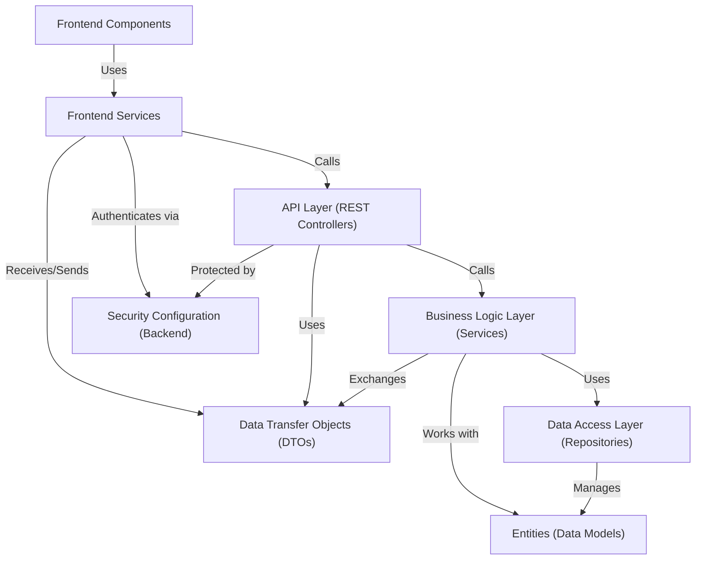

# Digital Banking
---
This project is a **digital banking system** allowing users to manage bank accounts and perform operations like debits, credits, and transfers.
It has a backend API built with Spring Boot to handle the core logic and data, and a frontend built with Angular for users to *interact* with the system securely.
It models key banking concepts like customers, accounts (current and savings), and transactions.

## Visual Overview

## Chapters

1. [Entities (Data Models)
](01_entities__data_models__.md)
2. [Data Transfer Objects (DTOs)
](02_data_transfer_objects__dtos__.md)
3. [Data Access Layer (Repositories)
](03_data_access_layer__repositories__.md)
4. [Business Logic Layer (Services)
](04_business_logic_layer__services__.md)
5. [API Layer (REST Controllers)
](05_api_layer__rest_controllers__.md)
6. [Security Configuration (Backend)
](06_security_configuration__backend__.md)
7. [Frontend Services
](07_frontend_services_.md)
8. [Frontend Components
](08_frontend_components_.md)

---
